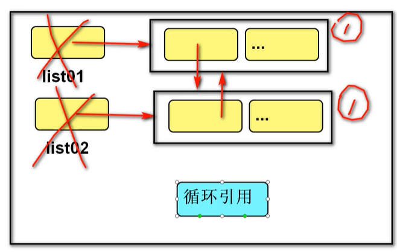
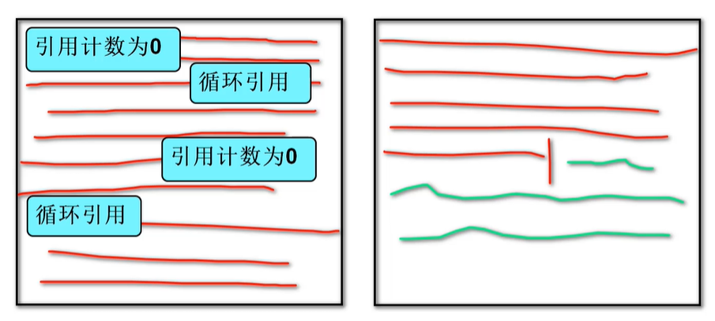
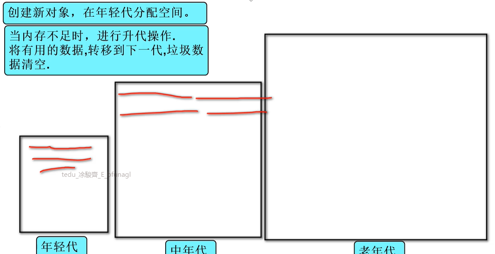

## Part 4-1 Python核心總複習

> 計算機基礎結構

* 程式碼在CPU執行，運行在內存之中，硬碟紀錄數據資料
* 硬碟先給內存資料，CPU再對內存資料運算


> python 簡介

* 交互式python: 主要是計算簡單運算，在終端機可以直接運行
* 文件式python: 主要書寫的文件，使用Linux指令去執行 ( 第二階段會講解


* **python 執行過程**

  ```
  源代碼  `-"編譯(compile)">  字節碼(.pyc)  -解釋(interpret)->     機器碼`
  |        第一次觸發              |  
  main.py  --  入口代碼要簡潔，才不會每次都要開很久
  python的編譯不是電腦可以看的懂的1001，是運行之後為了優化，形成的代碼叫做字節碼
  ```

  

> 數據基本運算

* **自動化內存管理機制** 

  1. 引用計數(Reference Count): 每個對象紀錄被變量綁定(引用)的數量，當為0時，自動銷毀。

     > EX:

     ```python
     a = "悟空"  # 引用計數增加1
     b = a      # 引用計數增加1
     c = b      # 引用計數增加1
     del a      # 引用計數減少1
     b = "八戒"  # 引用計數減少1
     c = None   # 引用計數減少1
     # 悟空因為引用計數為0，所以被銷毀
     ```

     * 缺點: 對循環引用會有內存洩漏(memory leak)，失去對記憶體的控制，造成內存浪費。

       > EX:

       ```
       list01 = []
       list02 = []
       list01.append(list02)
       list02.append(list01)
       del list01, list2
       # 如下圖，會變成兩個拉基互相取暖，引用計數不為0，不會銷毀
       ```

       

  2. 標記清除(Mark-and-Sweep): 當內存不足對整塊空間進行掃描，清空垃圾數據(整理有用的數據，後面來的數據在綠色的部分)。

     

     * 缺點: 全盤掃描內存，計算量大

  3. 分代回收(Weak Generational Hypothesis): 將內存劃分為多個區域(0代、1代、2代....)，升代操作是用上面的標記清除做掃描，老年代全滿會overflow。

     

  4. 內存優化: 

     * 盡量少產生拉基: 像是對不可變對象的頻繁修改，改成對可變對象的修改... 
     * 對象池: 減少重複對象的存在，減少對象創建與銷毀
       * 字串、數，同一個會在同一個地址。
       * 列表裡面的元素一樣，則是在不同地址
       * class沒有對象池，所以要自己做一個，就是搜索元素有沒有重複，如果有就不創建，指向的地址
     * 可以設置分代回收參數: 在切換遊戲場景時，回收拉基...，這個需要業務邏輯，我們通常不寫


* pycharm 快捷鍵
  * 註釋代碼: ctrl + /
  * 複製行: ctrl + d
  * 選擇列: 滑鼠左鍵 + alt
  * 移動行: shift + alt + 上下箭頭
  * 智能提示: ctrl + space
  * 自動縮排: ctrl + alt + l
  * 替換文字: ctrl +R  (改變反白內容的文字，要輸入取代和被取代的文字)
  * 選取列: shift +alt


> **容器類型**

* 字符串(str) : 存儲字符編碼，不可變序列
* 列表(list) : 存儲變量，可變序列
* 元組(tuple) : 存儲變量，不可變序列
* 字典(dict) : 存儲鍵值對，可變序列
* 集合(set) : 存儲鍵，可變序列


* 序列與散列:
  * 序列: 連續的內存空間，有順序(索引、切片)
  * 散列: 不連續的內存空間。順序(通過key)
* 可變與不可變:
  * 可變: 預留空間
  * 不可變: 按需分配


> 函數(function)

* 一個函數一個功能!

* **可變與不可變對象的傳參**

  ```python
  def func01(p1, p2)
  	# 不可變數據，在函數內的修改，不影響函數外
  	p1 = 2
  	# 可變數據，在函數內的修改，可以影響函數外
  	p2[0] = 2
  
  a = 1
  list01 = [1]
  func01(a, list01)
  print(a)  # 1
  print(list01)  # [2]
  ```

  > 結論

  * 傳入可變對象，修改可變對象，可以不不通過返回值傳遞結果


* **函數參數**

  * 實參: 如何給形參傳遞數據

    * 位置實參: 根據順序對應
      * 序列實參: `函數名(*序列)`           [拆] ，裡面是list，對應到各個參數
    * 關鍵字實參: 根據名稱對應 
      * `函數名(形參名 = 數據)`，如果沒有填入值，就是默認值
      * 字典實參: `函數名(**字典)`          [拆]，裡面是dict，對應到各個參數

  * 形參: 規定傳參方式

    * 默認參數: 實參可以不傳遞

      `def 函數名(形參名 = 默認值)`

    * 位置形參: 實參必須傳遞

      * 星號元組形參: 實參數量無限 
        * `def 函數名(*args)`           [合]      

    * 命名關鍵字形參:

      `def 函數名(*args, a, b)`

      `def 函數名(*, a, b)`

      * 雙星號字典形參: 關鍵字實參數量無限 
        * `def 函數名(*kwargs)`       [合]      


## Part 4-2 面相對象總複習

> 概述

* 面相過程: 考慮問題從步驟(實現細節)角度出發
* 面相對象: 考慮問題從對象(誰)角度出發


> 類和對向

* 實例成員: 變量、方法。   每個對象不同的數據行為。
* 類成員: 變量、方法。   大家(共享)的數據與行為。
* 靜態方法: 函數。      工具


> 三大特徵

* 封裝: 分而治之 (變化點單獨定義)
* 繼承: 抽象   -->  統一  -->  隔離(變化點)
* 多態: 執行變化，定義變化 (重寫)
* 核心理念: 先用，再做


> 設計原則

* **六大原則**
  1. 開閉原則: 允許增加新功能，不能修改客戶端代碼。
  2. 單一職責: 每個類有且只有一個改變的原因
  3. 依賴倒置: 調用父，不調用子
  4. 組合複用: 僅使用代碼，優先考慮組合關係
  5. 里氏替換: 父出現的地方，可以使用子替換，建議使用擴展重寫
  6. 迪米特: 低耦合


## Part 4-3 Python高級總複習

> 程序結構

* 導入三種方式
  1. `import 路徑.模塊 as 別名`
  2. `from 路徑.模塊 import 成員`
  3. `from 路徑.模塊 import *`
* **導入封包成功條件**: `sys.path` + 導入路徑 = 真實路徑


> 異常處理

* 語法

  ```
  try:
  	可能觸發異常的語句
  except 錯誤類型1 [as 變量1]:
  	處理語句1
  except 錯誤類型2 [as 變量2]:
  	處理語句2
  except Exception [as 變量3]:  # 通常最後都會加
  	不是以上錯誤類型的處裡語句
  else:  # 最少用
  	未發生異常的語句
  finally:
  	無論對錯都執行的語句
  ```

* 現象: 當異常發生時，程序不會再向下執行，而轉到函數的調用與句

* 目的: 讓程序正常執行 [將異常流程(向上)轉換為正常流程(向下)]

* 目標: 邏輯錯誤，非語法錯誤

* 人為拋出異常: 外速傳遞信息，可以自訂義異常類，封裝錯誤信息

  `raise 異常對象`


> 迭代

* 可迭代對象: `__iter__`, 可以參與for循環，拿到容器的iterator 
  * `iterator = list.__iter__()`
* 迭代器: `__next__`, 可以通過next取值，拿到容器下一個的值 
  * `item = iterator.__next__()`


> 生成器 (generator)

* 特點: 惰性/延遲 (循環一次/計算一次/返回一次)，可以用標記清除刪掉垃圾資料

* 生成器函數: yield
  * 如果結果多個，使用yield返回，單個，使用return
* 生成器表達式: 推導式語法


> 函數式編程

* 函數作為參數: 將核心邏輯傳入函數，從而得到通用的函數
  * 重點: IterableHelper (day12/common/iterable_tool.py) ，集成操作框架
  * 上面的IterableHelper會了，可以大膽的說: 我精通函數式編成!
* 函數作為返回值: 邏輯連續
  * 閉包、裝飾器


## Part 4-4 階段項目-2048(上)

* `if __name__ == '__main__':` ，這個是測試代碼，必須要在主模塊才會執行

* 不需要別人訪問的實例成員，可以用兩個下滑線隱藏

  ```python
  def zero_to_end(self):
  	pass
  	
  # 變成下面
  def __zero_to_end(self):
  	pass
  ```


game2048/bll.py

doc 1

## Part 4-5 階段項目-2048(中)


game2048/bll.py

game2048/model.py

doc 2、3


## Part 4-6 階段項目-2048(下)

* USL: **User Show Layer**     [V]
* BLL: **Business Logic Layer **     [C]
* model: 模型     [M]


> 遊戲運行會有兩個主要程式碼(跟unity一樣XD):

* __start(): 開始邏輯

* __update(): 遊戲運行邏輯

  

> 使用os

```python
import os  # 使用作業系統的指令，要在作業系統終端執行才會有效果(linux)!!!

os.system("clear")  # 清除畫面
```


game2048/bll.py 

game2048/usl.py


如果以後要做大項目，USL要有很多，可以用一個父類，把每個隔開(依賴倒置: 調用父不調用子)


不同架構的程式碼寫法(Delphi 三層架構、MVC): 

https://codeantenna.com/a/Ieh2TUzzja

